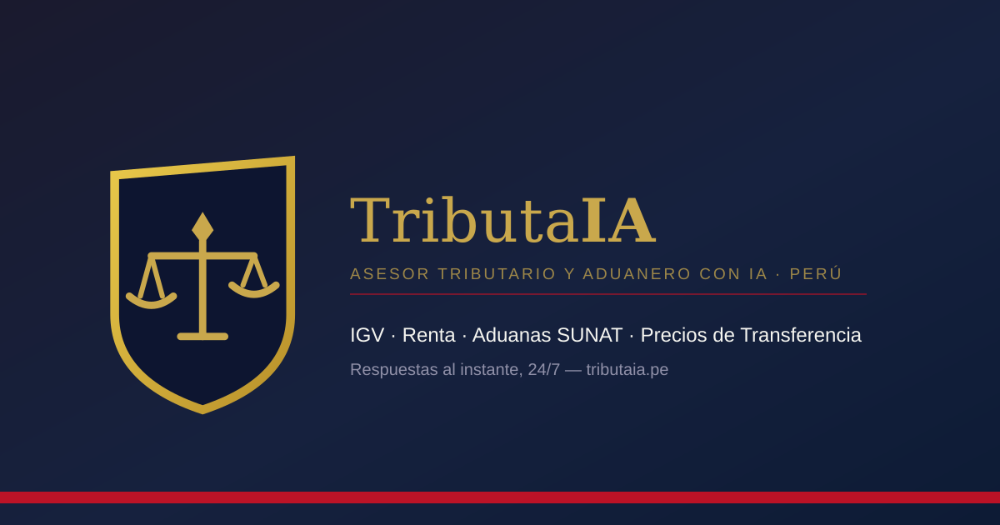

<p align="center">
  
</p>

# Declarafy

**Plataforma TaxTech con IA para pymes, mypes y emprendedores del Perú**

[](https://declarafy.com)
[](#qué-hace-declarafy)
[](https://www.php.net/)
[](https://www.mysql.com/)
[](https://playwright.dev/)

Declarafy es una plataforma TaxTech diseñada para facilitar la gestión tributaria, contable y de cumplimiento para **pymes, mypes, emprendedores y usuarios profesionales en el Perú**.

El proyecto reúne herramientas tributarias, información regulatoria, calculadoras, módulos funcionales y capacidades asistidas por IA dentro de una sola plataforma web.

🌐 **Producción:** https://declarafy.com

---

## 🖼 Vista previa de Declarafy

<p align="center">
  <a href="https://declarafy.com">
    
  </a>
</p>

<p align="center">
  <strong>Asesor tributario con IA para pymes y mypes del Perú.</strong><br>
  <a href="https://declarafy.com">Visitar declarafy.com</a>
</p>

---

## 🇵🇪 Qué hace Declarafy

Declarafy está diseñado en torno a flujos prácticos para negocios y gestión tributaria, incluyendo áreas como:

- Información de RUC y contribuyentes
- Flujos relacionados con SUNAT
- Calendarios y vencimientos tributarios
- Cálculos tributarios y laborales
- Análisis financiero y contable
- Monitoreo normativo
- Documentación tributaria
- Flujos de pago y activación de planes
- Programa de referidos
- Módulos especializados para empresas
- Soporte informativo y funcional asistido por IA

La plataforma está orientada al mercado peruano y continúa ampliando su cobertura funcional.

---

## 🧩 Áreas actuales de la plataforma

| Área | Ejemplos |
|---|---|
| Cumplimiento tributario | SUNAT, flujos relacionados con PDT, calendarios y alertas |
| Análisis tributario | Soporte para impuestos empresariales y personales |
| Laboral y planillas | AFP, ONP, CTS, gratificaciones y cálculos relacionados |
| Finanzas empresariales | Flujo de caja, análisis financiero y valorización de empresas |
| Inteligencia regulatoria | Monitoreo de normas y flujos de actualización |
| Documentación | Reportes, cartas y soporte documental legal/tributario |
| Pagos | Activación de planes mediante Culqi |
| Integraciones | Credenciales SUNAT y puntos de integración vía API |
| Programa de referidos | Funcionalidad comercial y crecimiento de usuarios |
| Pruebas | Pruebas estáticas, verificación de despliegue y Playwright E2E |

---

## 🏗 Arquitectura

Declarafy utiliza actualmente una arquitectura pensada para hosting compartido estándar:

- **Frontend:** HTML, CSS y JavaScript
- **Backend:** PHP 8.3
- **Base de datos:** MySQL / MariaDB
- **Hosting:** Namecheap / cPanel
- **Pruebas E2E:** Playwright
- **Pagos:** integración con Culqi
- **SUNAT:** flujos públicos de RUC y puntos de integración con credenciales oficiales
- **PWA:** service worker, manifest e íconos

Firebase **no es necesario** para el flujo actual de registro, inicio de sesión y almacenamiento de datos.

---

## 📂 Estructura del repositorio

Áreas importantes del proyecto:

- `api/` — endpoints backend, configuración y esquema de base de datos
- `src/` — código estructurado de la aplicación
- `tests/` — pruebas automatizadas
- `scripts/` — utilidades de validación y despliegue
- `docs/` — documentación del proyecto
- `index.html` — aplicación principal
- `app.js` — lógica principal
- `styles.css` — estilos
- `sw.js` — service worker
- `NAMECHEAP_DEPLOYMENT.md` — guía de despliegue en producción
- `TESTING.md` — estrategia y comandos de prueba
- `FRONTEND_REVIEW.md` — notas de revisión del frontend

---

## 🧪 Pruebas

Instalar dependencias:

```bash
npm ci
```

Ejecutar validaciones estáticas y de estructura:

```bash
npm test
```

Ejecutar pruebas E2E locales:

```bash
npx playwright install chromium
npm run test:e2e
```

Ejecutar pruebas E2E contra producción:

```bash
npm run test:e2e:production
```

El repositorio también incluye automatización mediante GitHub Actions para pruebas y smoke tests de producción.

---

## 🚀 Despliegue

El despliegue en producción utiliza **PHP 8.3 + MySQL/MariaDB** sobre Namecheap/cPanel.

Consulta **[NAMECHEAP_DEPLOYMENT.md](NAMECHEAP_DEPLOYMENT.md)** para:

- Creación de la base de datos
- Importación del esquema
- Configuración del servidor
- Claves API y credenciales
- Integración con SUNAT
- Configuración del webhook de Culqi
- Verificaciones de salud en producción

Archivos sensibles como `config.local.php` **no deben subirse a GitHub**.

---

## 🔐 Principios de seguridad

El proyecto contempla varios controles importantes:

- Manejo del lado servidor de claves sensibles
- Autenticación respaldada por base de datos
- Separación entre secretos locales y el repositorio
- Verificación del lado servidor de pagos antes de activar planes
- Uso de credenciales separadas para pruebas E2E
- Health checks de producción
- Validación automatizada de la estructura de despliegue

Cualquier cambio sensible debe revisarse antes de pasar a producción.

---

## 🗺 Dirección del producto

Prioridades actuales del desarrollo:

- Mejorar módulos tributarios especializados
- Ampliar funcionalidades conectadas con SUNAT
- Fortalecer flujos tributarios asistidos por IA
- Mejorar la usabilidad móvil
- Aumentar la cobertura de pruebas automatizadas
- Consolidar la arquitectura backend
- Mejorar reportes e informes ejecutivos
- Ampliar el monitoreo normativo
- Fortalecer el sistema de referidos y flujos comerciales

---

## ⚠️ Aviso importante

Declarafy es una plataforma tecnológica orientada a apoyar procesos tributarios, contables y empresariales.

La información generada o mostrada por la plataforma no debe interpretarse automáticamente como asesoría legal, contable o tributaria individualizada. Las decisiones relevantes deben contrastarse con fuentes oficiales de SUNAT y, cuando corresponda, con un profesional calificado.

---

## 👤 Proyecto

Creado y desarrollado bajo la dirección de **Christian Dobrofsky**.

- **GitHub:** [@kkarmacy](https://github.com/kkarmacy)
- **Sitio web:** [declarafy.com](https://declarafy.com)
